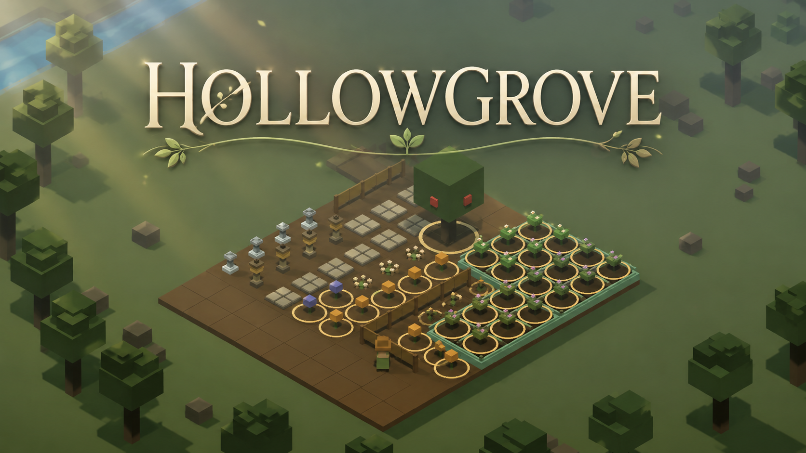

# Hollowgrove

<p align="center">
  
</p>

<p align="center">
  <strong>A cozy farming and gardening game built with Three.js.</strong>
</p>

---

## 🌿 About

**Hollowgrove** is a relaxing browser-based gardening game where you cultivate crops, decorate your grove, and unwind in a peaceful low-poly forest. Plant seasonal flowers, tend your garden, expand your homestead, and enjoy the tranquil atmosphere.

Built entirely with **HTML**, **JavaScript**, and **Three.js**, Hollowgrove runs directly in your browser—no installation required.

---

## ✨ Features

* 🌱 Plant, water, and harvest crops
* 🌸 Grow seasonal flowers and decorative plants
* 🌳 Peaceful low-poly forest aesthetic
* 🌦 Dynamic weather and atmospheric effects
* 🏡 Expand and customize your garden
* 💾 Automatic local save system
* 🎮 Runs entirely in your browser

---

## 🎮 Controls

| Key         | Action                 |
| ----------- | ---------------------- |
| **W A S D** | Move                   |
| **Q / E**   | Rotate camera          |
| **R**       | Rotate selected object |
| **B**       | Dig soil               |
| **T**       | Open Trade Menu        |
| **Esc**     | Close menus            |
| **1**       | Cycle weather (debug)  |

---

## 🚀 Play Online

Play the latest version here:

```text
https:/FireEden.github.io/hollowgrove/
```

---

## 🖥 Running Locally

Simply download or clone the repository and open:

```text
index.html
```

in any modern web browser.

For the best development experience, serve the project with a simple local web server (such as the VS Code **Live Server** extension).

---

## 🛠 Built With

* HTML5
* JavaScript (ES6)
* Three.js
* CSS3

No frameworks or build tools required.

---

## 📸 Screenshots

More screenshots and gameplay GIFs coming soon.

---

## 🚧 Development Status

Hollowgrove is currently under active development.

Planned additions include:

* 🐝 Wildlife and insects
* 🏠 More buildings and decorations
* 🌼 Additional flowers and crops
* 🎵 Ambient music and sound effects
* 🎯 More gameplay systems and polish

---

## 🤝 Contributing

This project is currently a personal hobby project and is not accepting external contributions.

Feel free to open an issue if you discover a bug or have a suggestion.

---

## 📜 License

This project is provided for viewing and playing only.

All rights reserved unless otherwise specified.

---

<p align="center">
Made with ❤️ using Three.js
</p>
